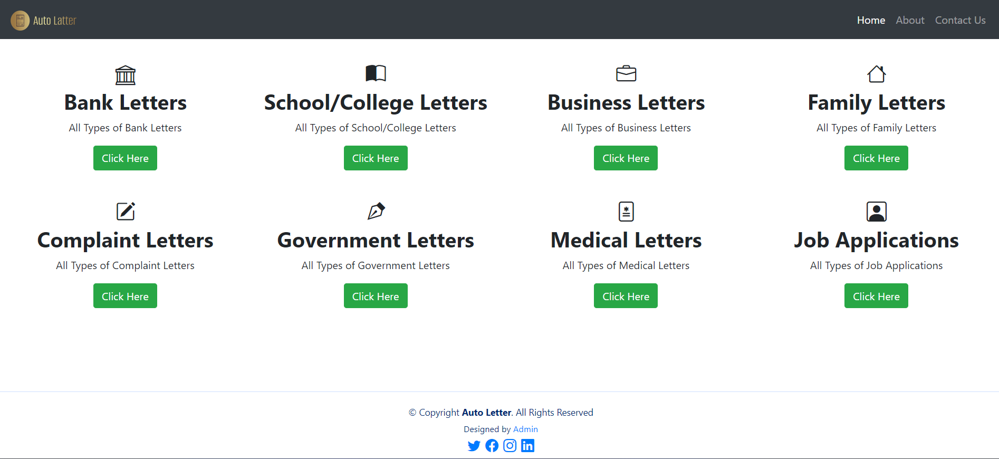
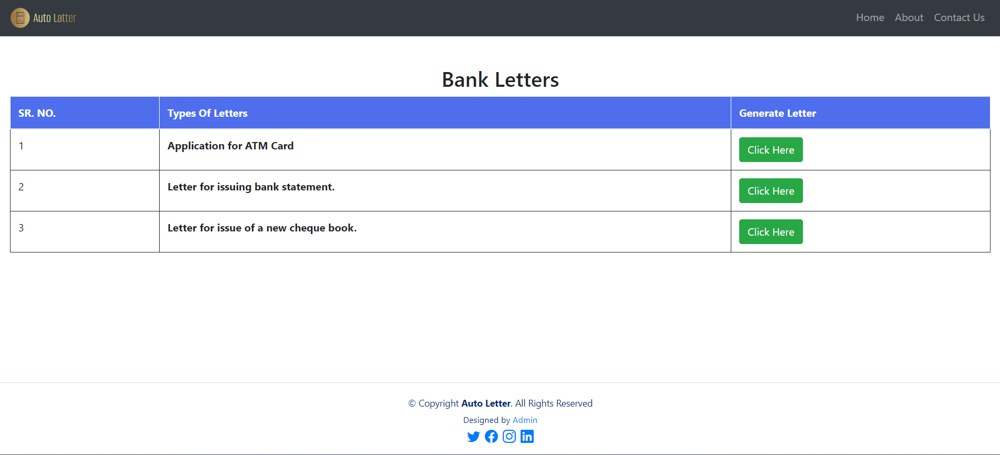
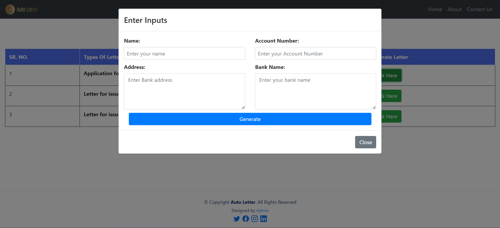

# ✉️ Auto Dynamic Letter Web Application

The **Auto Dynamic Letter Web Application** is a dynamic website designed to simplify the process of generating formal or personalized letters. Through a user-friendly interface, users can create fully formatted letters automatically by simply selecting a subject of their choice.

## 📝 Description

This web-based tool reduces the time and effort needed to draft commonly used letters. It is perfect for office staff, students, and professionals who frequently generate repetitive letter formats. Users can select a predefined subject and provide a few inputs to auto-generate a ready-to-use letter.

Built using a combination of:
- **HTML**, **CSS**, **Bootstrap** – for responsive and clean UI
- **JavaScript** – for dynamic interactions
- **PHP** – to handle backend logic
- **MySQL** – for managing subject templates and user data

---

## 🚀 Features

- 📚 Predefined letter subjects
- ✍️ Dynamic content generation
- ⚡ Real-time preview
- 🖨️ Print or save letters (optional)
- 📱 Fully responsive on all devices

---

## 💻 Technologies Used

| Component     | Technology         |
|---------------|--------------------|
| Frontend      | HTML, CSS, Bootstrap, JavaScript |
| Backend       | PHP                |
| Database      | MySQL              |
| Server Stack  | WAMP (Windows Apache MySQL PHP) |

---

## ⚙️ Installation Guide (WAMP)

### Step 1: Clone or Download

```bash
git clone https://github.com/yourusername/auto-dynamic-letter.git
````

Or download the ZIP and extract the folder.

### Step 2: Move to WAMP Directory

Copy the extracted project folder into your WAMP `www` directory:

```
C:\wamp64\www\
```

### Step 3: Setup MySQL Database

1. Start **WAMP** and ensure both Apache and MySQL are running (green icon).
2. Go to: `http://localhost/phpmyadmin`
3. Create a new database named: `letter_app`
4. Import the provided SQL file (e.g., `letter_app.sql`) from the project folder.

### Step 4: Run the Web App

Visit your local server URL:

```
http://localhost/auto-dynamic-letter
```

---

## 📄 Usage Instructions

1. Open the website in your browser.
2. Select the subject of the letter from the dropdown.
3. Fill in the required personal or official information.
4. Click **Generate** to view the formatted letter.
5. Print or copy the letter as needed.

---

## 📷 Screenshots

> ## 📷 Screenshots

### 🏠 Home Page


### 📄 Subject Page


### ✍️ Form Input Page



---

## 📂 Folder Structure

```
auto-dynamic-letter/
├── index.php
├── letter.php
├── /assets
│   ├── style.css
│   └── script.js
├── /templates
│   └── letter_templates.sql
├── /db
│   └── config.php
└── README.md
```
## 🙏 Acknowledgements

* Bootstrap (UI framework)
* WAMP Stack (Local server)
* phpMyAdmin (Database tool)
* Open-source contributors and testers

---

## 📬 Contact

For feedback, suggestions, or support:
📧 Email: [aniltaur9921@gmail.com](mailto:aniltaur9921@gmail.com)
🔗 GitHub: [Anil-Taur]([https://github.com/Anil-Taur])

```
